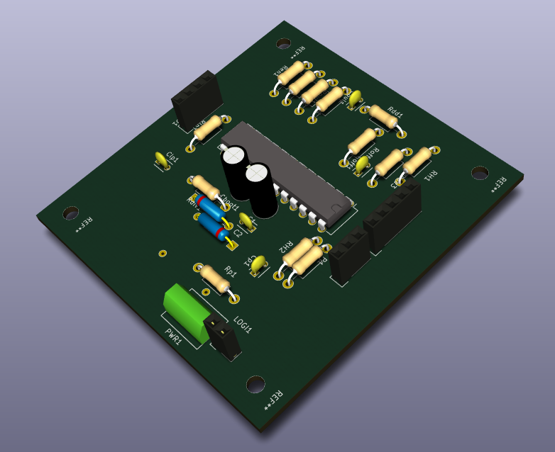
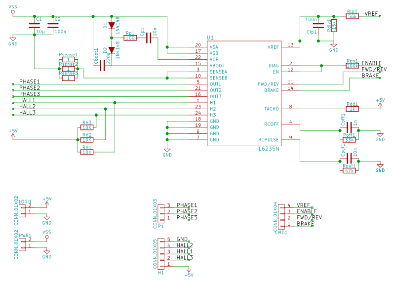
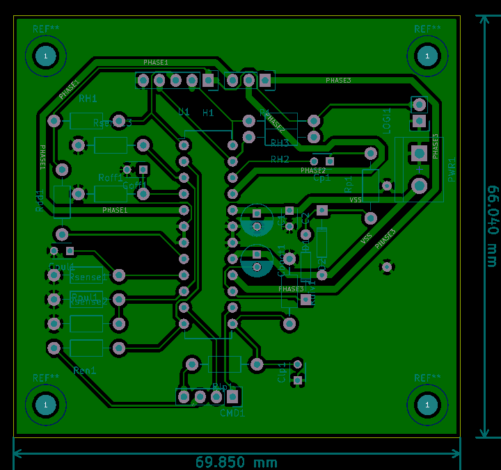

# L6235-PCB

Implements the "typical application" ([datasheet](./doc/datasheet.pdf)) as a single sided PCB.  

## Specifications

- Require a 5V logic supply voltage (LOGI1), as well as a power one (PWR1)
- 69.8*66mm. 4 M3 mounting holes
- Variable reference voltage as described in the ([application note](./doc/application_note.pdf)) through VREF pin (CMD1)

## Schematic

## PCB

